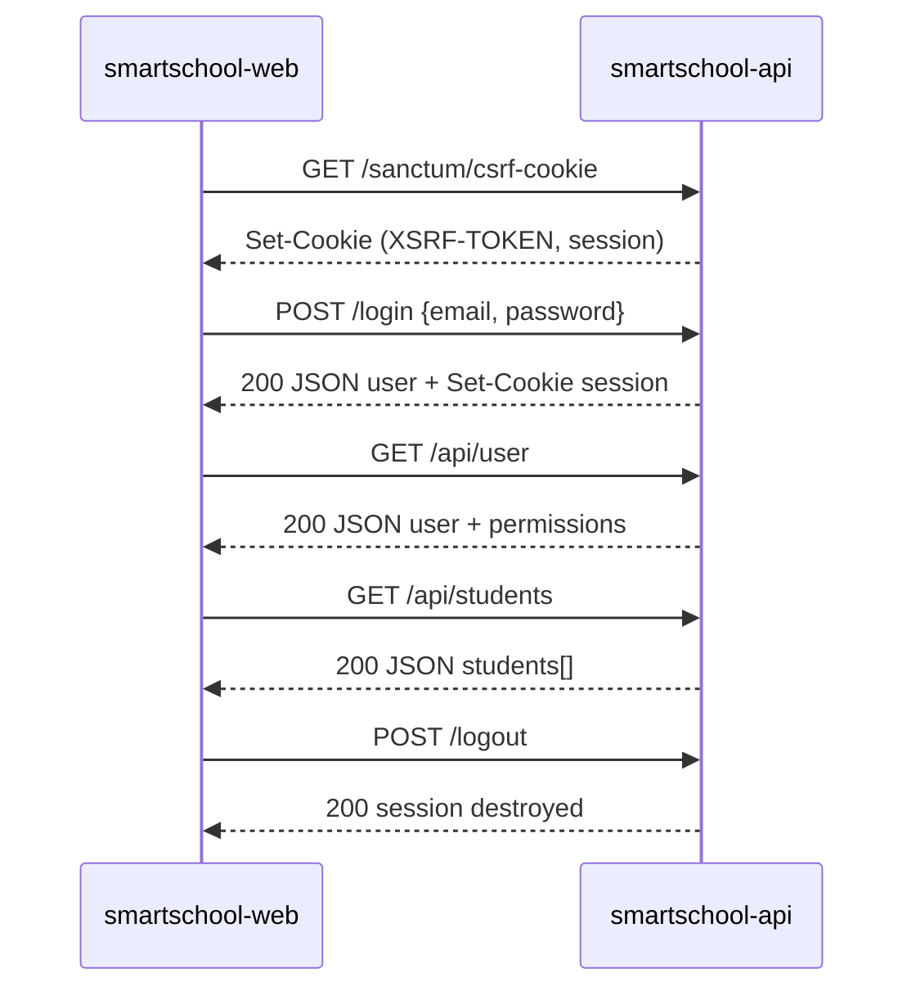

# SmartSchool — Guide de Séparation Frontend / Backend

**Objectif :** Scinder SmartSchool-full en deux dépôts autonomes : `smartschool-api` (Laravel API pure) et `smartschool-web` (SPA React).  
**Documents liés :** [`RAPPORT_ANALYSE_SEPARATION.md`](./RAPPORT_ANALYSE_SEPARATION.md) · [`GUIDE_ARCHITECTURE_RESTRUCTURATION.md`](./GUIDE_ARCHITECTURE_RESTRUCTURATION.md)  
**Version :** 1.0 — 24 mai 2026

---

## Table des matières

1. [Pourquoi et dans quel état on part](#1-pourquoi-et-dans-quel-état-on-part)
2. [Architecture cible](#2-architecture-cible)
3. [Inventaire des dépendances Inertia](#3-inventaire-des-dépendances-inertia)
4. [Répartition des fichiers entre les deux dépôts](#4-répartition-des-fichiers-entre-les-deux-dépôts)
5. [Backend — smartschool-api](#5-backend--smartschool-api)
6. [Frontend — smartschool-web](#6-frontend--smartschool-web)
7. [Authentification cross-origin (Sanctum SPA)](#7-authentification-cross-origin-sanctum-spa)
8. [Migration fichier par fichier](#8-migration-fichier-par-fichier)
9. [Environnements dev et production](#9-environnements-dev-et-production)
10. [Plan d'exécution étape par étape](#10-plan-dexécution-étape-par-étape)
11. [Checklist de validation](#11-checklist-de-validation)
12. [Risques et parades](#12-risques-et-parades)

---

## 1. Pourquoi et dans quel état on part

### 1.1 Problème actuel

Aujourd'hui, **un seul projet Laravel** sert à la fois :

- Le **serveur API** (`routes/api.php`, contrôleurs, on thentifiés)
- Le **serveur de navigation** (Inertia rend les pages React via `routes/web.php`)
- Le **build frontend** (Vite compilé dans `public/build/`)

```
┌─────────────────────────────────────────────────────────┐
│              SmartSchool-full (monolithe)                │
│                                                          │
│  web.php ──► Inertia ──► React page shell               │
│  api.php  ──► Sanctum  ──► JSON (données CRUD)          │
│                                                          │
│  Même domaine, même déploiement, même repo               │
└─────────────────────────────────────────────────────────┘
```

### 1.2 Bonne nouvelle : le gros du travail API est déjà fait

Les **11 modules métier** consomment déjà l'API REST pour leurs données :

| Module | Appels API identifiés |
|--------|----------------------|
| Students | `/api/students`, `/api/classes` |
| Grades | `/api/grades/*` (6+ appels) |
| Finance | `/api/payments`, `/api/students`, `/api/reports/stats` |
| Admissions | `/api/admissions` |
| Communication | `/api/announcements` |
| Events | `/api/events` |
| Inventory | `/api/inventory` |
| Users | `/api/users`, `/api/user` |
| Settings | `/api/settings`, `/api/roles` |
| Reports | `/api/reports/stats` |
| Dashboard | `/api/reports/stats` |

**Ce qui reste couplé à Inertia :**

| Couplage | Fichiers concernés | Effort |
|----------|-------------------|--------|
| Navigation pages | `routes/web.php`, `router.visit()` | Moyen |
| Auth user injectée | `usePage().props.auth` | Faible |
| Liens menu | `Sidebar.tsx`, `Header.tsx` — `Link` Inertia | Faible |
| Pages login Breeze | `Pages/Auth/*`, contrôleurs Auth Inertia | Moyen |
| Titre page | `Head` Inertia dans chaque feature | Faible |
| Permissions UI | `Can.tsx` lit `usePage()` | Faible |

**Estimation globale : 2 à 4 semaines** pour un split propre.

---

## 2. Architecture cible

### 2.1 Vue d'ensemble

```
┌─────────────────────────┐         HTTPS + cookies         ┌─────────────────────────┐
│     smartschool-web     │ ◄──────────────────────────────► │     smartschool-api     │
│                         │         CORS credentials          │                         │
│  React 18 + Vite 7      │                                   │  Laravel 12 API pure    │
│  react-router-dom       │  GET  /sanctum/csrf-cookie        │  Sanctum stateful       │
│  AuthProvider           │  POST /login                      │  routes/api.php         │
│  Axios (withCredentials)│  GET  /api/user                   │  routes/auth.php (JSON) │
│                         │  CRUD /api/*                      │  Pas d'Inertia          │
│  app.smartschool.cd     │                                   │  api.smartschool.cd     │
│  (ou localhost:5173)    │                                   │  (ou localhost:8000)    │
└─────────────────────────┘                                   └─────────────────────────┘
         SPA statique                                                  MySQL
    (CDN / Hostinger static)                                    (Hostinger backend)
```

### 2.2 Principes non négociables

| # | Principe |
|---|----------|
| 1 | L'API **ne rend jamais** de HTML/React — uniquement JSON |
| 2 | Le frontend **ne possède aucune** route Laravel — uniquement React Router |
| 3 | L'auth repose sur **cookies session Sanctum** (pas JWT sauf décision contraire) |
| 4 | Les URLs API sont **absolues** via `VITE_API_URL` — fini les `/api/...` relatifs |
| 5 | CORS autorise **une seule origine** frontend avec `supports_credentials: true` |

### 2.3 Ce qui ne change PAS

- Les endpoints API existants (`/api/students`, `/api/grades/*`, etc.)
- Le middleware `CheckPermission` et le format `resource:action`
- Les modèles Eloquent et la base de données
- La logique métier dans les contrôleurs API
- La structure `Features/` côté React (renommée `features/`)

---

## 3. Inventaire des dépendances Inertia

### 3.1 Backend — à retirer ou adapter

| Fichier | Action |
|---------|--------|
| `routes/web.php` (pages métier) | **Supprimer** — remplacé par le routeur SPA |
| `resources/views/app.blade.php` | **Supprimer** |
| `app/Http/Middleware/HandleInertiaRequests.php` | **Supprimer** |
| `bootstrap/app.php` — middleware Inertia | **Retirer** du groupe web |
| `composer.json` — `inertiajs/inertia-laravel` | **Retirer** |
| `composer.json` — `tightenco/ziggy` | **Retirer** (routes JS inutiles en SPA) |
| Contrôleurs Auth — `Inertia::render()` | **Adapter** → JSON ou supprimer les `create()` |
| `ProfileController.php` | **Migrer** vers API ou supprimer |
| `public/build/` versionné | **Ne plus versionner** dans l'API call API |

### 3.2 Backend — à conserver et adapter

| Fichier | Action |
|---------|--------|
| `routes/api.php` | **Conserver** tel quel |
| `routes/auth.php` | **Adapter** — login/logout retournent JSON |
| `AuthenticatedSessionController::store()` | Retourner `204` ou JSON au lieu de `redirect()` |
| `AuthenticatedSessionController::destroy()` | Idem |
| `config/sanctum.php` | **Configurer** domaines stateful |
| `config/cors.php` | **Publier et configurer** |

### 3.3 Frontend — imports Inertia à remplacer

| Import Inertia | Remplacement SPA |
|----------------|------------------|
| `createInertiaApp` (`app.tsx`) | `createRoot` + `BrowserRouter` |
| `usePage().props.auth` | `useAuth()` depuis `AuthProvider` |
| `Link` from `@inertiajs/react` | `Link` from `react-router-dom` |
| `router.visit('/path')` | `useNavigate()('/path')` |
| `Head` from `@inertiajs/react` | `react-helmet-async` ou `<title>` natif |
| `useForm` from `@inertiajs/react` | État React local + Axios |

### 3.4 Fichiers frontend avec dépendance Inertia (liste exhaustive)

**Core (priorité haute — impact global) :**

| Fichier | Usage Inertia |
|---------|---------------|
| `resources/js/app.tsx` | Point d'entrée Inertia |
| `resources/js/Core/Components/Sidebar.tsx` | `Link`, `usePage` |
| `resources/js/Core/Components/Header.tsx` | `Link`, `usePage` |
| `resources/js/Core/Components/Can.tsx` | `usePage().props.auth` |

**Features (Head + parfois usePage/router) :**

| Fichier | Usage Inertia |
|---------|---------------|
| `Features/Dashboard/Pages/DashboardHome.tsx` | `Head`, `router.visit()` |
| `Features/Students/Pages/StudentManagement.tsx` | `Head`, `router.visit()` |
| `Features/Finance/Pages/FinancialDashboard.tsx` | `Head` |
| `Features/Grades/Pages/GradesPage.tsx` | `Head`, `usePage` |
| `Features/Users/Pages/ProfilePage.tsx` | `Head`, `usePage` |
| `Features/Users/Pages/UserManagement.tsx` | `Head` |
| + 6 autres features | `Head` uniquement |

**Auth Breeze legacy (à migrer vers `features/auth/`) :**

- `resources/js/Pages/Auth/Login.jsx`
- `resources/js/Pages/Auth/Register.jsx`
- `resources/js/Pages/Auth/ForgotPassword.jsx`
- `resources/js/Pages/Auth/ResetPassword.jsx`
- `resources/js/Pages/Auth/VerifyEmail.jsx`
- `resources/js/Pages/Auth/ConfirmPassword.jsx`

---

## 4. Répartition des fichiers entre les deux dépôts

### 4.1 smartschool-api (Backend)

```
smartschool-api/
├── app/
│   ├── Http/
│   │   ├── Controllers/
│   │   │   ├── Api/              ← TOUS les contrôleurs API (12 fichiers)
│   │   │   └── Auth/             ← Adaptés JSON (login/logout)
│   │   ├── Middleware/
│   │   │   └── CheckPermission.php
│   │   ├── Requests/
│   │   └── Resources/            ← NOUVEAU : API Resources Laravel
│   ├── Models/                   ← 15 modèles
│   └── Services/
│       └── GradeCalculationService.php
├── bootstrap/app.php             ← Sans middleware Inertia
├── config/
│   ├── database/
├── routes/
│   ├── api.php                   ← Inchangé
│   └── auth.php                  ← Adapté JSON
├── tests/
├── composer.json                 ← Sans inertia, sans ziggy
├── .env.example
└── artisan
```

**Exclus de l'API :**

```
resources/js/          → smartschool-web
resources/views/     → supprimé (sauf emails Blade si besoin)
public/build/        → supprimé (build côté web)
vite.config.js       → supprimé
package.json         → supprimé (ou minimal pour assets emails)
```

### 4.2 smartschool-web (Frontend)

```
smartschool-web/
├── src/
│   ├── main.tsx                  ← Remplace app.tsx
│   ├── router/
│   │   ├── index.tsx             ← Toutes les routes
│   │   ├── ProtectedRoute.tsx    ← Auth + permission guard
│   │   └── GuestRoute.tsx        ← Redirige si déjà connecté
│   ├── core/
│   │   ├── api/
│   │   │   └── client.ts         ← Axios configuré (VITE_API_URL)
│   │   ├── auth/
│   │   │   ├── AuthProvider.tsx  ← Remplace usePage().props.auth
│   │   │   └── useAuth.ts
│   │   ├── layouts/
│   │   │   └── DashboardLayout.tsx
│   │   └── components/
│   │       ├── Sidebar.tsx       ← react-router Link
│   │       ├── Header.tsx
│   │       ├── Can.tsx           ← useAuth() au lieu de usePage()
│   │       └── Pagination.tsx
│   ├── features/
│   │   ├── auth/                 ← Login, Register (migré depuis Pages/Auth)
│   │   ├── dashboard/
│   │   ├── students/
│   │   ├── grades/
│   │   ├── finance/
│   │   ├── admissions/
│   │   ├── communication/
│   │   ├── events/
│   │   ├── inventory/
│   │   ├── users/
│   │   ├── reports/
│   │   └── settings/
│   └── styles/
│       └── app.css
├── index.html                    ← Point d'entrée HTML (plus de Blade)
├── package.json
├── vite.config.ts
├── tsconfig.json
└── .env.example                  ← VITE_API_URL=http://localhost:8000
```

---

## 5. Backend — smartschool-api

### 5.1 Modifications `bootstrap/app.php`

**Avant :**

```php
$middleware->web(append: [
    \App\Http\Middleware\HandleInertiaRequests::class,
    \Illuminate\Http\Middleware\AddLinkHeadersForPreloadedAssets::class,
]);
```

**Après :**

```php
$middleware->web(append: [
    // Middleware web minimal pour auth Breeze (sessions)
]);

$middleware->api(prepend: [
    \Laravel\Sanctum\Http\Middleware\EnsureFrontendRequestsAreStateful::class,
]);

$middleware->alias([
    'permission' => \App\Http\Middleware\CheckPermission::class,
]);
```

### 5.2 Adapter le login pour JSON

**Fichier :** `app/Http/Controllers/Auth/AuthenticatedSessionController.php`

```php
public function store(LoginRequest $request): JsonResponse
{
    $request->authenticate();
    $request->session()->regenerate();

    return response()->json([
        'data' => new UserResource($request->user()),
    ]);
}

public function destroy(Request $request): JsonResponse
{
    Auth::guard('web')->logout();
    $request->session()->invalidate();
    $request->session()->regenerateToken();

    return response()->json(['message' => 'Logged out.']);
}
```

Supprimer les méthodes `create()` qui font `Inertia::render()` — le frontend SPA possède ses propres pages login.

### 5.3 Routes auth adaptées

**Fichier :** `routes/auth.php` (version API)

```php
Route::middleware('guest')->group(function () {
    Route::post('login', [AuthenticatedSessionController::class, 'store']);
    Route::post('register', [RegisteredUserController::class, 'store']);
    Route::post('forgot-password', [PasswordResetLinkController::class, 'store']);
    Route::post('reset-password', [NewPasswordController::class, 'store']);
});

Route::middleware('auth')->group(function () {
    Route::post('logout', [AuthenticatedSessionController::class, 'destroy']);
    Route::get('api/user', fn (Request $request) => new UserResource($request->user()));
});
```

> Note : `GET /api/user` existe déjà dans `routes/api.php`. Éviter la duplication — un seul endpoint.

### 5.4 User Resource (hydratation frontend)

**Nouveau fichier :** `app/Http/Resources/UserResource.php`

```php
public function toArray(Request $request): array
{
    return [
        'id' => $this->id,
        'first_name' => $this->first_name,
        'last_name' => $this->last_name,
        'email' => $this->email,
        'role' => $this->role,
        'avatar' => $this->avatar,
        'is_active' => $this->is_active,
        'all_permissions' => $this->all_permissions,
    ];
}
```

### 5.5 Configuration CORS

**Publier :** `php artisan config:publish cors`

**Fichier :** `config/cors.php`

```php
return [
    'paths' => ['api/*', 'sanctum/csrf-cookie', 'login', 'logout', 'register'],
    'allowed_methods' => ['*'],
    'allowed_origins' => [env('FRONTEND_URL', 'http://localhost:5173')],
    'allowed_origins_patterns' => [],
    'allowed_headers' => ['*'],
    'exposed_headers' => [],
    'max_age' => 0,
    'supports_credentials' => true,
];
```

### 5.6 Configuration Sanctum

**Fichier :** `.env`

```env
APP_URL=http://localhost:8000
FRONTEND_URL=http://localhost:5173
SANCTUM_STATEFUL_DOMAINS=localhost,localhost:5173,127.0.0.1,127.0.0.1:5173
SESSION_DOMAIN=localhost
```

**Production :**

```env
APP_URL=https://api.smartschool.cd
FRONTEND_URL=https://app.smartschool.cd
SANCTUM_STATEFUL_DOMAINS=app.smartschool.cd
SESSION_DOMAIN=.smartschool.cd
SESSION_SECURE_COOKIE=true
SESSION_SAME_SITE=lax
```

### 5.7 Adapter CheckPermission (plus de redirect Inertia)

**Fichier :** `app/Http/Middleware/CheckPermission.php`

Remplacer le bloc redirect :

```php
// SUPPRIMER ce bloc :
if ($request->wantsJson() && !$request->header('X-Inertia')) { ... }
return redirect()->route('home')->with('error', '...');

// GARDER uniquement :
return response()->json([
    'error' => 'Access Denied',
    'message' => "Droits insuffisants. Requiert : {$permission}",
], 403);
```

### 5.8 Route fallback API

**Ajouter dans `routes/api.php` :**

```php
Route::fallback(function () {
    return response()->json(['message' => 'Not Found.'], 404);
});
```

---

## 6. Frontend — smartschool-web

### 6.1 Point d'entrée SPA

**Fichier :** `src/main.tsx`

```tsx
import React from 'react';
import { createRoot } from 'react-dom/client';
import { BrowserRouter } from 'react-router-dom';
import { AuthProvider } from './core/auth/AuthProvider';
import AppRouter from './router';
import './styles/app.css';

createRoot(document.getElementById('root')!).render(
  <React.StrictMode>
    <BrowserRouter>
      <AuthProvider>
        <AppRouter />
      </AuthProvider>
    </BrowserRouter>
  </React.StrictMode>
);
```

**Fichier :** `index.html`

```html
<!DOCTYPE html>
<html lang="fr">
  <head>
    <meta charset="UTF-8" />
    <meta name="viewport" content="width=device-width, initial-scale=1.0" />
    <title>SmartSchool RDC</title>
  </head>
  <body>
    <div id="root"></div>
    <script type="module" src="/src/main.tsx"></script>
  </body>
</html>
```

### 6.2 Client API

**Fichier :** `src/core/api/client.ts`

```typescript
import axios from 'axios';

const api = axios.create({
  baseURL: import.meta.env.VITE_API_URL,
  withCredentials: true,
  withXSRFToken: true,
  headers: {
    Accept: 'application/json',
    'Content-Type': 'application/json',
    'X-Requested-With': 'XMLHttpRequest',
  },
});

export async function initCsrf(): Promise<void> {
  await api.get('/sanctum/csrf-cookie');
}

export default api;
```

### 6.3 AuthProvider (remplace usePage().props.auth)

**Fichier :** `src/core/auth/AuthProvider.tsx`

```tsx
import React, { createContext, useContext, useEffect, useState } from 'react';
import api, { initCsrf } from '../api/client';

interface User {
  id: number;
  first_name: string;
  last_name: string;
  email: string;
  role: string;
  all_permissions: string[];
  is_active: boolean;
}

interface AuthContextType {
  user: User | null;
  loading: boolean;
  login: (email: string, password: string) => Promise<void>;
  logout: () => Promise<void>;
  refreshUser: () => Promise<void>;
}

const AuthContext = createContext<AuthContextType | null>(null);

export function AuthProvider({ children }: { children: React.ReactNode }) {
  const [user, setUser] = useState<User | null>(null);
  const [loading, setLoading] = useState(true);

  const refreshUser = async () => {
    try {
      const { data } = await api.get('/api/user');
      setUser(data.data ?? data);
    } catch {
      setUser(null);
    }
  };

  useEffect(() => {
    initCsrf().then(refreshUser).finally(() => setLoading(false));
  }, []);

  const login = async (email: string, password: string) => {
    await initCsrf();
    await api.post('/login', { email, password });
    await refreshUser();
  };

  const logout = async () => {
    await api.post('/logout');
    setUser(null);
  };

  return (
    <AuthContext.Provider value={{ user, loading, login, logout, refreshUser }}>
      {children}
    </AuthContext.Provider>
  );
}

export function useAuth() {
  const ctx = useContext(AuthContext);
  if (!ctx) throw new Error('useAuth must be used within AuthProvider');
  return ctx;
}
```

### 6.4 Routeur SPA (miroir de web.php)

**Fichier :** `src/router/index.tsx`

```tsx
import { Routes, Route, Navigate } from 'react-router-dom';
import ProtectedRoute from './ProtectedRoute';
import GuestRoute from './GuestRoute';

// Lazy loading par feature
const DashboardHome = lazy(() => import('../features/dashboard/DashboardHome'));
const StudentManagement = lazy(() => import('../features/students/StudentManagement'));
const FinancialDashboard = lazy(() => import('../features/finance/FinancialDashboard'));
// ... autres imports lazy

export default function AppRouter() {
  return (
    <Suspense fallback={<div className="loading">Chargement...</div>}>
      <Routes>
        {/* Routes publiques */}
        <Route element={<GuestRoute />}>
          <Route path="/login" element={<LoginPage />} />
        </Route>

        {/* Routes protégées */}
        <Route element={<ProtectedRoute />}>
          <Route path="/" element={<DashboardHome />} />
          <Route path="/dashboard" element={<DashboardHome />} />
          <Route path="/students" element={
            <ProtectedRoute permission="students:read"><StudentManagement /></ProtectedRoute>
          } />
          <Route path="/finance" element={
            <ProtectedRoute permission="finance:read"><FinancialDashboard /></ProtectedRoute>
          } />
          <Route path="/grades" element={
            <ProtectedRoute permission="grades:read"><GradesPage /></ProtectedRoute>
          } />
          <Route path="/admissions" element={
            <ProtectedRoute permission="admissions:read"><AdmissionManagement /></ProtectedRoute>
          } />
          <Route path="/communication" element={
            <ProtectedRoute permission="communication:read"><CommunicationCenter /></ProtectedRoute>
          } />
          <Route path="/events" element={
            <ProtectedRoute permission="events:read"><EventsPage /></ProtectedRoute>
          } />
          <Route path="/inventory" element={
            <ProtectedRoute permission="inventory:read"><InventoryPage /></ProtectedRoute>
          } />
          <Route path="/users" element={
            <ProtectedRoute permission="users:read"><UserManagement /></ProtectedRoute>
          } />
          <Route path="/reports" element={
            <ProtectedRoute permission="reports:read"><ReportsPage /></ProtectedRoute>
          } />
          <Route path="/settings" element={
            <ProtectedRoute permission="settings:read"><SettingsPage /></ProtectedRoute>
          } />
          <Route path="/profile" element={<ProfilePage />} />
        </Route>

        <Route path="*" element={<Navigate to="/" replace />} />
      </Routes>
    </Suspense>
  );
}
```

### 6.5 ProtectedRoute (auth + permissions)

**Fichier :** `src/router/ProtectedRoute.tsx`

```tsx
import { Navigate, Outlet } from 'react-router-dom';
import { useAuth } from '../core/auth/AuthProvider';
import DashboardLayout from '../core/layouts/DashboardLayout';

function hasPermission(userPermissions: string[], required: string): boolean {
  if (userPermissions.includes('*')) return true;
  if (userPermissions.includes(required)) return true;
  const [resource] = required.split(':');
  return userPermissions.includes(`${resource}:*`);
}

export default function ProtectedRoute({
  permission,
  children,
}: {
  permission?: string;
  children?: React.ReactNode;
}) {
  const { user, loading } = useAuth();

  if (loading) return <div className="loading">Chargement...</div>;

  if (!user) return <Navigate to="/login" replace />;

  if (permission && !hasPermission(user.all_permissions, permission)) {
    return <Navigate to="/" replace />;
  }

  if (children) {
    return <DashboardLayout>{children}</DashboardLayout>;
  }

  return (
    <DashboardLayout>
      <Outlet />
    </DashboardLayout>
  );
}
```

### 6.6 Adapter Can.tsx

**Avant :**

```tsx
import { usePage } from '@inertiajs/react';
const { auth } = usePage<any>().props;
```

**Après :**

```tsx
import { useAuth } from '../auth/useAuth';
const { user } = useAuth();
const perms = user?.all_permissions ?? [];
```

### 6.7 Adapter Sidebar.tsx

**Avant :**

```tsx
import { Link, usePage } from '@inertiajs/react';
<Link href={`/${item.id}`} ...>
```

**Après :**

```tsx
import { Link, useLocation } from 'react-router-dom';
const location = useLocation();
const activePage = location.pathname.split('/')[1] || 'dashboard';
<Link to={`/${item.id}`} ...>
```

### 6.8 Adapter les appels API (URLs absolues)

**Avant (relatif — fonctionne car même domaine) :**

```typescript
await axios.get('/api/students');
await fetch('/api/reports/stats');
```

**Après (via client centralisé) :**

```typescript
import api from '@/core/api/client';
await api.get('/api/students');
await api.get('/api/reports/stats');
```

> **Action :** Rechercher/remplacer dans toutes les features :
> - `axios.get('/api/` → `api.get('/api/`
> - `fetch('/api/` → `api.get('/api/` ou équivalent
> - Supprimer les imports `axios` directs — utiliser le client centralisé

### 6.9 Adapter router.visit()

**Fichiers concernés :**
- `DashboardHome.tsx` — 4 occurrences
- `StudentManagement.tsx` — 2 occurrences

**Avant :**

```tsx
import { router } from '@inertiajs/react';
router.visit('/students');
router.visit(`/finance?student=${studentId}`);
```

**Après :**

```tsx
import { useNavigate } from 'react-router-dom';
const navigate = useNavigate();
navigate('/students');
navigate(`/finance?student=${studentId}`);
```

### 6.10 package.json cible

```json
{
  "name": "smartschool-web",
  "private": true,
  "type": "module",
  "scripts": {
    "dev": "vite",
    "build": "tsc && vite build",
    "preview": "vite preview"
  },
  "dependencies": {
    "axios": "^1.11.0",
    "react": "^18.2.0",
    "react-dom": "^18.2.0",
    "react-router-dom": "^6.28.0"
  },
  "devDependencies": {
    "@types/react": "^18.2.0",
    "@types/react-dom": "^18.2.0",
    "@vitejs/plugin-react": "^4.2.0",
    "typescript": "^5.6.0",
    "vite": "^7.0.7"
  }
}
```

**Dépendances retirées :** `@inertiajs/react`, `laravel-vite-plugin`

### 6.11 vite.config.ts cible

```typescript
import { defineConfig } from 'vite';
import react from '@vitejs/plugin-react';
import path from 'path';

export default defineConfig({
  plugins: [react()],
  resolve: {
    alias: {
      '@': path.resolve(__dirname, './src'),
    },
  },
  server: {
    port: 5173,
    proxy: {
      // Option dev : proxy vers l'API locale (évite CORS en dev)
      '/api': 'http://localhost:8000',
      '/sanctum': 'http://localhost:8000',
      '/login': 'http://localhost:8000',
      '/logout': 'http://localhost:8000',
    },
  },
});
```

> **Alternative dev :** Utiliser le proxy Vite (ci-dessus) **ou** configurer CORS Sanctum. Le proxy est plus simple en local.

---

## 7. Authentification cross-origin (Sanctum SPA)

### 7.1 Flux complet

```
Étape 1 — Initialisation CSRF
─────────────────────────────
SPA  →  GET https://api.smartschool.cd/sanctum/csrf-cookie
API  ←  Set-Cookie: XSRF-TOKEN=...; laravel_session=...

Étape 2 — Login
───────────────
SPA  →  POST https://api.smartschool.cd/login
        Headers: X-XSRF-TOKEN, Cookie
        Body: { email, password }
API  ←  200 JSON { data: { user... } }
        Set-Cookie: laravel_session=... (renouvelé)

Étape 3 — Requêtes authentifiées
────────────────────────────────
SPA  →  GET https://api.smartschool.cd/api/students
        Headers: X-XSRF-TOKEN, Cookie (auto via withCredentials)
API  ←  200 JSON { data: [...] }

Étape 4 — Logout
────────────────
SPA  →  POST https://api.smartschool.cd/logout
API  ←  200 JSON, session invalidée
```

### 7.2 Diagramme de séquence



### 7.3 Erreurs courantes et solutions

| Erreur | Cause | Solution |
|--------|-------|----------|
| 419 CSRF token mismatch | Cookie XSRF non initialisé | Appeler `/sanctum/csrf-cookie` avant login |
| 401 Unauthenticated | Cookie session non envoyé | `withCredentials: true` sur Axios |
| CORS blocked | Origine non autorisée | `FRONTEND_URL` dans `config/cors.php` |
| Cookie not set cross-domain | `SESSION_DOMAIN` incorrect | `.smartschool.cd` en prod |
| 403 sur preflight OPTIONS | CORS mal configuré | `supports_credentials: true` + origine explicite |

---

## 8. Migration fichier par fichier

### 8.1 Ordre de migration recommandé

```
Semaine 1 — Préparation backend
├── Configurer CORS + Sanctum
├── Adapter login/logout JSON
├── Créer UserResource
├── Adapter CheckPermission (JSON only)
└── Supprimer routes web.php métier

Semaine 2 — Scaffold frontend
├── Créer repo smartschool-web
├── Copier Features/ → src/features/
├── Copier Core/ → src/core/
├── Créer AuthProvider, client API, router
└── Adapter Sidebar, Header, Can

Semaine 3 — Migration features
├── Remplacer Head Inertia → title natif
├── Remplacer router.visit → useNavigate
├── Remplacer axios/fetch relatifs → client API
├── Migrer pages Auth Breeze → features/auth/
└── Tests manuels par module

Semaine 4 — Finition
├── CI séparée (API + Web)
├── Déploiement staging
├── Retirer Inertia du composer.json
├── Supprimer fichiers legacy
└── Documentation deploy
```

### 8.2 Table de correspondance routes

| Route Inertia (web.php) | Route React Router | Feature |
|-------------------------|-------------------|---------|
| `/` | `/` | dashboard/DashboardHome |
| `/dashboard` | `/dashboard` | dashboard/DashboardHome |
| `/students` | `/students` | students/StudentManagement |
| `/finance` | `/finance` | finance/FinancialDashboard |
| `/grades` | `/grades` | grades/GradesPage |
| `/admissions` | `/admissions` | admissions/AdmissionManagement |
| `/communication` | `/communication` | communication/CommunicationCenter |
| `/events` | `/events` | events/EventsPage |
| `/inventory` | `/inventory` | inventory/InventoryPage |
| `/users` | `/users` | users/UserManagement |
| `/reports` | `/reports` | reports/ReportsPage |
| `/settings` | `/settings` | settings/SettingsPage |
| `/profile` | `/profile` | users/ProfilePage |
| `/login` | `/login` | auth/LoginPage |

---

## 9. Environnements dev et production

### 9.1 Développement local

**Terminal 1 — API :**

```bash
cd smartschool-api
cp .env.example .env
php artisan key:generate
php artisan migrate --seed
php artisan serve    # http://localhost:8000
```

**Terminal 2 — Web :**

```bash
cd smartschool-web
cp .env.example .env
npm install
npm run dev          # http://localhost:5173
```

**`.env` API (dev) :**

```env
APP_URL=http://localhost:8000
FRONTEND_URL=http://localhost:5173
SANCTUM_STATEFUL_DOMAINS=localhost:5173,localhost:8000,127.0.0.1:5173
SESSION_DOMAIN=localhost
```

**`.env` Web (dev) :**

```env
VITE_API_URL=http://localhost:8000
```

> Astuce : avec le proxy Vite (§6.11), on peut mettre `VITE_API_URL=` vide et laisser le proxy gérer.

### 9.2 Production (Hostinger)

**Option A — Deux sous-domaines (recommandée) :**

| Service | URL | Hébergement |
|---------|-----|-------------|
| API | `api.smartschool.cd` | Hostinger — dossier `backend/` |
| Web | `app.smartschool.cd` | Hostinger — dossier `frontend/` (static) |

**Deploy API :**

```bash
cd smartschool-api
composer install --no-dev
php artisan migrate --force
php artisan config:cache
php artisan route:cache
# Pas de npm run build — pas de frontend
```

**Deploy Web :**

```bash
cd smartschool-web
npm ci
VITE_API_URL=https://api.smartschool.cd npm run build
# Copier dist/ vers public_html/frontend/
```

**Option B — Même domaine, chemins différents :**

| Service | URL |
|---------|-----|
| API | `smartschool.cd/api/` |
| Web | `smartschool.cd/` |

Plus complexe (rewrite rules, cookies). **Option A préférée.**

### 9.3 CI/CD cible

**API — `.github/workflows/api-tests.yml` :**

```yaml
name: API Tests
on: [push, pull_request]
jobs:
  test:
    runs-on: ubuntu-latest
    steps:
      - uses: actions/checkout@v4
      - uses: php-actions/composer@v6
      - run: php artisan test
```

**Web — `.github/workflows/web-build.yml` :**

```yaml
name: Web Build
on: [push, pull_request]
jobs:
  build:
    runs-on: ubuntu-latest
    steps:
      - uses: actions/checkout@v4
      - uses: actions/setup-node@v4
        with:
          node-version: 20
      - run: npm ci
      - run: npm run build
        env:
          VITE_API_URL: https://api.smartschool.cd
```

---

## 10. Plan d'exécution étape par étape

### Étape 1 — Préparer l'API (sans casser le monolithe)

1. Publier et configurer `config/cors.php`
2. Ajouter `FRONTEND_URL` et `SANCTUM_STATEFUL_DOMAINS` au `.env`
3. Créer `UserResource`
4. Adapter `AuthenticatedSessionController` pour retourner JSON **en plus** du redirect (transition)
5. Adapter `CheckPermission` pour toujours retourner JSON sur les routes API

### Étape 2 — Créer le scaffold SPA

1. `npm create vite@latest smartschool-web -- --template react-ts`
2. Copier `resources/js/Features/` → `src/features/`
3. Copier `resources/js/Core/` → `src/core/`
4. Copier `resources/css/app.css` → `src/styles/app.css`
5. Installer `react-router-dom`, configurer Axios
6. Créer `AuthProvider`, `ProtectedRoute`, router

### Étape 3 — Migrer les composants Core

1. `Sidebar.tsx` — Inertia Link → react-router Link
2. `Header.tsx` — idem
3. `Can.tsx` — usePage → useAuth
4. `DashboardLayout.tsx` — aucun changement structurel

### Étape 4 — Migrer les features une par une

Pour chaque feature, dans l'ordre :

1. Dashboard (simple, 1 appel API)
2. Inventory (CRUD complet, bon test)
3. Events (CRUD)
4. Settings
5. Communication
6. Admissions
7. Reports
8. Finance
9. Students
10. Users
11. Grades (le plus complexe — en dernier)

**Par feature :**
- [ ] Remplacer `Head` Inertia
- [ ] Remplacer `usePage` par `useAuth`
- [ ] Remplacer `router.visit` par `useNavigate`
- [ ] Migrer appels API vers client centralisé
- [ ] Tester CRUD complet

### Étape 5 — Migrer l'authentification

1. Créer `features/auth/LoginPage.tsx` (depuis `Pages/Auth/Login.jsx`)
2. Connecter au flux Sanctum (§7)
3. Tester login → dashboard → logout
4. Tester redirection si non authentifié

### Étape 6 — Nettoyer le monolithe

1. Supprimer Inertia de `composer.json`
2. Supprimer `routes/web.php` pages métier
3. Supprimer `HandleInertiaRequests.php`
4. Supprimer `resources/views/app.blade.php`
5. Supprimer `resources/js/` (tout migré)
6. Supprimer `public/build/` du repo
7. Renommer le repo en `smartschool-api`

---

## 11. Checklist de validation

### Backend (smartschool-api)

- [ ] `composer.json` ne contient plus `inertiajs/inertia-laravel`
- [ ] Aucune route web ne fait `Inertia::render()`
- [ ] `POST /login` retourne JSON 200
- [ ] `POST /logout` retourne JSON 200
- [ ] `GET /api/user` retourne user + `all_permissions`
- [ ] CORS autorise l'origine frontend avec credentials
- [ ] `CheckPermission` retourne toujours JSON (401/403)
- [ ] Tous les tests PHPUnit passent
- [ ] `/api/fix-admin` supprimé

### Frontend (smartschool-web)

- [ ] Aucun import `@inertiajs/react`
- [ ] Toutes les routes définies dans React Router
- [ ] Login → redirect dashboard fonctionne
- [ ] Logout → redirect login fonctionne
- [ ] Sidebar filtre par permissions
- [ ] `<Can permission="...">` fonctionne
- [ ] Chaque module CRUD testé manuellement
- [ ] Build production (`npm run build`) sans erreur
- [ ] Aucun appel API relatif (`/api/...`) — tout via `VITE_API_URL`

### Intégration

- [ ] Login cross-origin fonctionne (cookies)
- [ ] CSRF initialisé avant login
- [ ] Session persiste au refresh de page
- [ ] 401 redirect vers /login
- [ ] 403 affiche message ou redirect dashboard
- [ ] Deploy staging validé

---

## 12. Risques et parades

| Risque | Impact | Parade |
|--------|--------|--------|
| Cookies cross-domain bloqués | Auth impossible | `SESSION_DOMAIN=.smartschool.cd`, HTTPS obligatoire |
| CORS mal configuré | Toutes requêtes API échouent | Tester avec curl + browser devtools Network |
| Oubli de migrer un `usePage` | Crash runtime | `grep -r usePage src/` avant merge |
| URLs API relatives en prod | 404 sur le SPA | Client Axios centralisé avec baseURL |
| Double maintenance pendant transition | Confusion | Feature flag ou branche dédiée `split/spa` |
| Upload fichiers (photos) cross-origin | Échec upload | Configurer CORS + `multipart/form-data` |
| Session expire silencieusement | UX dégradée | Intercepteur Axios 401 → redirect /login |

### Intercepteur Axios recommandé

```typescript
api.interceptors.response.use(
  (response) => response,
  (error) => {
    if (error.response?.status === 401) {
      window.location.href = '/login';
    }
    return Promise.reject(error);
  }
);
```

---

## Résumé

| Question | Réponse |
|----------|---------|
| **Est-ce prêt ?** | Oui à ~70 % — l'API existe, Inertia ne sert qu'à la navigation |
| **Effort total ?** | 2–4 semaines |
| **Par quoi commencer ?** | CORS + Sanctum + AuthProvider + Dashboard |
| **Plus gros chantier ?** | Migrer auth Breeze + retirer tous les `usePage`/`router.visit` |
| **Plus gros risque ?** | Cookies cross-domain en production |
| **Peut-on migrer module par module ?** | Oui — cohabitation temporaire monolithe Inertia + SPA sur routes différentes |

---

*SmartSchool — Guide de Séparation Frontend / Backend v1.0*
