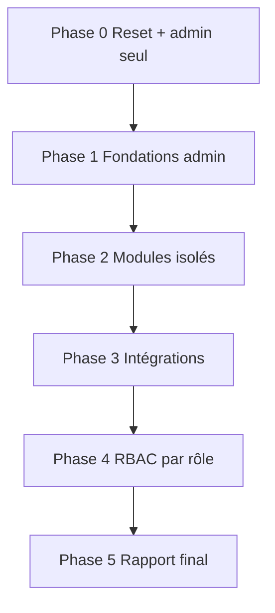

# Guide de test IA — SmartSchool

> **Public** : agent IA ou testeur automatisé  
> **Objectif** : parcourir l’application de zéro, valider chaque module, les permissions RBAC et les liens entre modules.  
> **Principe** : base vide → 1 admin → création progressive des données → test par rôle.

---

## 1. Architecture à connaître

| Composant | Dossier | URL dev |
|-----------|---------|---------|
| API Laravel | `SmartSchool-full/` | http://127.0.0.1:8000 |
| SPA React | `smartschool-web/` | http://127.0.0.1:5173 |

Auth : **Sanctum stateful** (cookies cross-origin).  
Les appels API doivent cibler `:8000`, jamais `:5173/api/*`.

---

## 2. Reset complet (OBLIGATOIRE avant chaque campagne)

```powershell
# Terminal 1 — API
cd "c:\Users\miche_fqui0oa\irmak project\SmartSchool-full"
php artisan migrate:fresh --seed --seeder=FreshStartSeeder
php artisan serve

# Terminal 2 — SPA
cd "c:\Users\miche_fqui0oa\irmak project\smartschool-web"
npm run dev
```

### Résultat attendu après reset

| Élément | Valeur |
|---------|--------|
| Tables | Toutes migrées, **aucune donnée métier** |
| Utilisateurs | **1 seul** : `admin@smartschool.cd` |
| Mot de passe | `password` |
| Rôles (profils) | **7 profils** pré-créés (voir §3) |
| Élèves, classes, paiements… | **0** |

Vérification rapide :

```powershell
php artisan tinker --execute="echo 'users='.App\Models\User::count().' roles='.App\Models\Role::count().' students='.App\Models\Student::count();"
# Attendu : users=1 roles=7 students=0
```

---

## 3. Matrice RBAC (rôles pré-installés)

L’admin ne crée **pas** les rôles : ils existent déjà via `RolesSeeder`.  
L’admin crée les **utilisateurs de test** et leur assigne un rôle.

| Slug | Nom | Menu SPA visible | Permissions clés |
|------|-----|------------------|------------------|
| `admin` | Administrateur | Tout | `*` |
| `director` | Directeur | Dashboard, Élèves, Académique, Finance, Admissions, Communication, Calendrier, Rapports | lecture transversale + `reports:*` |
| `teacher` | Enseignant | Dashboard, Élèves, Académique | `students:*`, `classes:*`, `grades:*` |
| `accountant` | Comptable | Dashboard, Élèves (lecture), Finance | `finance:*`, `payments:*` |
| `secretary` | Secrétaire | Dashboard, Élèves, Admissions, Communication, Calendrier | `students:*`, `admissions:*`, `communication:*` |
| `inventory_manager` | Gestionnaire inventaire | Dashboard, Inventaire, Paramètres (lecture) | `inventory:*`, `settings:read` |
| `parent` | Parent | Dashboard, Mon profil uniquement | portail parent non implémenté côté SPA |

### Permissions par module (référence API auto-vérification)

| Module | Permission route SPA | Permission API typique |
|--------|---------------------|------------------------|
| Dashboard | (aucune) | `/api/reports/stats` (auth) |
| Élèves | `students:read` | `students:read`, `students:write` |
| Académique | `grades:read` | `grades:*` |
| Finance | `finance:read` | `finance:read`, `payments:*` |
| Admissions | `admissions:read` | `admissions:read` |
| Communication | `communication:read` | `/api/announcements` |
| Calendrier | `events:read` | `/api/events` |
| Inventaire | `inventory:read` | `inventory:read` |
| Utilisateurs | `users:read` | `users:read`, `users:write` |
| Rapports | `reports:read` | `/api/reports/stats` |
| Paramètres | `settings:read` | `settings:read`, `settings:write` |

---

## 4. Utilisateurs de test à créer (Phase 0 — en tant qu’admin)

Connecté en admin → **Utilisateurs** → créer ces comptes (mot de passe : `password` pour tous) :

| Email | Rôle (slug) | Usage |
|-------|-------------|-------|
| `directeur@test.local` | Directeur | Tests lecture / rapports |
| `prof@test.local` | Enseignant | Tests notes + classes |
| `comptable@test.local` | Comptable | Tests finance |
| `secretaire@test.local` | Secrétaire | Tests admissions + élèves |
| `inventaire@test.local` | Gestionnaire inventaire | Tests stock |

**Critère OK** : 6 utilisateurs au total (1 admin + 5 testeurs).

---

## 5. Ordre de test progressif



---

## Phase 0 — Environnement

- [ ] `migrate:fresh --seeder=FreshStartSeeder` exécuté
- [ ] API `:8000` répond JSON sur `/`
- [ ] SPA `:5173` charge la page login
- [ ] Login admin OK → dashboard visible
- [ ] Console navigateur : **0 erreur rouge**

---

## Phase 1 — Fondations (connecté en **admin**)

Créer les données de base dans cet ordre (dépendances respectées).

### 1.1 Paramètres

- [ ] Aller **Paramètres** → onglets visibles
- [ ] Modifier nom établissement → sauvegarder → recharger → valeur persistée

### 1.2 Classes scolaires (RDC)

Via **Classes** (`/classes`) — **avant** de créer des élèves :

- [ ] Ouvrir le catalogue : cycles Maternel, Primaire, CTEB, Humanités
- [ ] Créer `7ème année Éducation de Base A` et `B`
- [ ] Créer `1ère année des Humanités Électricité A` (option obligatoire)
- [ ] Vérifier nom généré automatiquement (niveau + option + salle)
- [ ] Assigner un professeur titulaire

### 1.3 Utilisateurs de test

- [ ] Créer les 5 utilisateurs du §4
- [ ] Vérifier **Paramètres → Profils & Permissions** : 7 rôles listés

### 1.4 Données minimales par module

| Module | Action admin | Donnée attendue |
|--------|--------------|-----------------|
| **Classes** | Créer salles par cycle/niveau/option | Liste ≥ 3 classes RDC |
| Élèves | Créer 3 élèves (2 en 6ème A, 1 en 5ème B) | Liste ≥ 3 |
| Admissions | Créer 2 candidatures | Liste ≥ 2 |
| Finance | Enregistrer 2 paiements (élèves différents) | Liste ≥ 2 |
| Communication | Publier 1 annonce | Liste ≥ 1 |
| Calendrier | Créer 1 événement | Visible calendrier |
| Inventaire | Ajouter 2 articles | Liste ≥ 2 |

**Critère OK Phase 1** : chaque module affiche des données créées par l’admin, sans erreur API 4xx/5xx.

---

## Phase 2 — Tests module par module (admin)

Pour chaque module, tester **CRUD complet** + pagination + retour navigation.

### Dashboard (`/`)

- [ ] KPI chargés depuis API (pas de données fictives)
- [ ] Pas de graphiques mock / bannières promo

### Classes (`/classes`)

- [ ] Catalogue cycles RDC visible
- [ ] CRUD salle (cycle → niveau → option Humanités → section)
- [ ] Filtres par cycle et année scolaire
- [ ] Suppression bloquée si élèves présents

### Élèves (`/students`)

- [ ] Liste avec skeleton puis données
- [ ] Créer élève (vue pleine page, pas modal géant)
- [ ] Modifier élève
- [ ] Ouvrir **Dossier élève** → 5 onglets :
  - [ ] **Profil** : infos personnelles
  - [ ] **Académique** : moyennes / notes (ou état vide cohérent)
  - [ ] **Finance** : paiements liés
  - [ ] **Présences** : enregistrer 1 présence + 1 absence
  - [ ] **Documents** : upload 1 fichier + suppression
- [ ] Bouton retour fonctionne

### Admissions (`/admissions`)

- [ ] Liste paginée
- [ ] Formulaire pleine page
- [ ] Changer statut candidature

### Finance (`/finance`)

- [ ] Liste paginée
- [ ] Créer paiement
- [ ] Filtrer via URL `?studentId=X` (depuis dossier élève)

### Académique (`/grades`)

- [ ] Sélectionner classe
- [ ] Saisir notes (si prof assigné à la classe)
- [ ] Sauvegarder sans erreur console

### Communication (`/communication`)

- [ ] Liste paginée
- [ ] Créer annonce (message vide ne doit **pas** crasher l’UI)

### Calendrier (`/events`)

- [ ] CRUD événement
- [ ] Formulaire scrollable sur petit écran

### Inventaire (`/inventory`)

- [ ] Liste + actions
- [ ] Pas d’icônes emoji cassées

### Utilisateurs (`/users`)

- [ ] CRUD utilisateur
- [ ] Assignation rôle

### Rapports (`/reports`)

- [ ] KPI cohérents avec données Phase 1
- [ ] Filtres changent l’affichage

### Paramètres (`/settings`)

- [ ] Profils & permissions : lire les 7 rôles
- [ ] Sauvegarde paramètres système

---

## Phase 3 — Intégrations inter-modules

| Flux | Étapes | Critère OK |
|------|--------|------------|
| **A** Admission → Élève | Candidature acceptée → élève créé ou lié | Élève visible dans liste |
| **B** Élève → Finance | Dossier élève onglet Finance → lien paiements | `/finance?studentId=` filtre |
| **C** Élève → Présences | Présence enregistrée | Taux présence mis à jour hero dossier |
| **D** Paiement → Rapports | Nouveau paiement | KPI revenus augmentent |
| **E** Notes → Rapports | Notes saisies | Moyennes visibles rapports / dossier |
| **F** Admin → Prof | Modifier prof enseignant + assigner classe/matière | Prof voit sa classe dans Académique |

---

## Phase 4 — Tests RBAC (un rôle à la fois)

**Procédure** : se déconnecter → se connecter avec le compte test → vérifier menu + accès + refus.

### Directeur (`directeur@test.local`)

| Doit voir | Ne doit PAS voir |
|-----------|-------------------|
| Menu | Dashboard, Élèves, Académique, Finance, Admissions, Communication, Calendrier, Rapports | Utilisateurs, Inventaire, Paramètres |
| Action | Consulter rapports | Créer paiement (403 API) |

### Enseignant (`prof@test.local`)

| Doit voir | Ne doit PAS voir |
|-----------|-------------------|
| Élèves, Académique | Finance, Utilisateurs, Paramètres |
| Saisir notes (si assigné) | Supprimer utilisateur |

### Comptable (`comptable@test.local`)

| Doit voir | Ne doit PAS voir |
|-----------|-------------------|
| Finance, Élèves (lecture) | Académique (écriture), Utilisateurs |

### Secrétaire (`secretaire@test.local`)

| Doit voir | Ne doit PAS voir |
|-----------|-------------------|
| Élèves, Admissions, Communication | Finance, Utilisateurs |

### Inventaire (`inventaire@test.local`)

| Doit voir | Ne doit PAS voir |
|-----------|-------------------|
| Inventaire | Finance, Élèves, Notes |

### Tests négatifs communs

- [ ] Accès direct URL interdite (ex. `/users` en comptable) → redirection `/`
- [ ] Appel API sans auth → 401
- [ ] Appel API sans permission → 403 JSON `{ "error": "Access Denied" }`
- [ ] Compte désactivé → 403

---

## Phase 5 — Qualité transversale

- [ ] Caractères français corrects (é, è, ô, °) — pas de `é`
- [ ] Taille police ~80 % (lisible)
- [ ] Skeleton au chargement (pas spinner bloquant)
- [ ] Tables sans animation de ligne
- [ ] Pagination fonctionne (Grades, Finance, Communication, Admissions)
- [ ] Network : requêtes sur `:8000`
- [ ] `npm run typecheck` OK
- [ ] `npm run build` OK
- [ ] `php artisan test` OK (49 tests)

---

## 6. Format de rapport de bugs (OBLIGATOIRE)

Pour chaque anomalie :

```markdown
### BUG-XXX — [Critique|Majeur|Mineur] Titre court

**Module** : Élèves / Finance / …
**Rôle** : admin / teacher / …
**URL** : http://127.0.0.1:5173/students
**Étapes** :
1. …
2. …

**Attendu** : …
**Obtenu** : …
**API** : GET http://127.0.0.1:8000/api/… → status / body
**Console** : copier l’erreur
**Capture** : (si disponible)
**Piste correction** : fichier suspecté
```

Priorités :
- **Critique** : crash, perte de données, auth cassée
- **Majeur** : fonctionnalité inaccessible, 403 incorrect
- **Mineur** : UI, typo, alignment

---

## 7. Commandes utiles

```powershell
# Reset vierge
php artisan migrate:fresh --seed --seeder=FreshStartSeeder

# Tests backend automatisés
php artisan test

# Tests backend ciblés
php artisan test --filter=StudentDossierApiTest
php artisan test --filter=GroupIntegrationApiTest

# Vérifier frontend
cd smartschool-web
npm run typecheck
npm run build

# Compter entités
php artisan tinker --execute="foreach(['User','Student','Payment','Role'] as \$m) echo \$m.'='.('App\\\\Models\\\\'.\$m)::count().PHP_EOL;"
```

---

## 8. Checklist synthèse (fin de campagne)

| Zone | Statut | Bugs |
|------|--------|------|
| Reset FreshStart | ☐ | |
| Phase 1 Fondations | ☐ | |
| Phase 2 Modules | ☐ | |
| Phase 3 Intégrations | ☐ | |
| Phase 4 RBAC | ☐ | |
| Phase 5 Qualité | ☐ | |
| Backend tests 49/49 | ☐ | |
| Frontend build OK | ☐ | |

---

## 9. Rappels pour l’agent IA

1. **Toujours** repartir de `FreshStartSeeder` — ne jamais tester sur des données fantômes d’une session précédente.
2. **Créer les données via l’UI** quand possible (valide le frontend) ; compléter par API si bloqué.
3. **Noter le rôle actif** dans chaque test RBAC.
4. En cas d’échec API, copier status + body JSON dans le rapport.
5. Ne pas modifier le plan de test : suivre l’ordre Phase 0 → 5.
6. Si un bug bloque une phase, le documenter et **contourner** si possible pour continuer les phases suivantes.

---

*Dernière mise à jour : campagne validation SmartSchool — architecture API + SPA séparée.*
